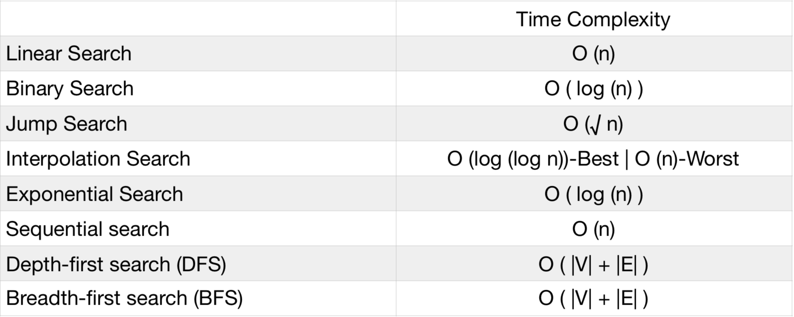

# Searching 





## All Binary Search Tagged LC Questions

https://leetcode.com/tag/binary-search/


## How Binary Search SHOULD work

The most classic off-by-one problem ever.

Is the dataset ordered? If yes...

We can keep cutting the list in half until we either have nothing, or we have our value.

This gets us to logN.

Sudo Code
```python

search(arr, lo, hi, n):

  midpoint = (lo + (hi - lo)) / 2

  value = arr[midpoint]

  # is the midpoint our value?
  if value = n:
    return true

  # we are treating low as inclusive and high as exclusive.

  # is it on the upper side?
  elif value > midpoint:
    lo = midpoint + 1
  # otherwise its on the lower side  
  else:
    hi = midpoint

  # exit condition - if the points cross
  while(lo < hi):
    return false

```
